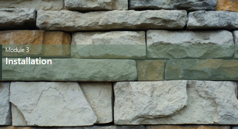

# Module 3 Installation


## Installation NodeJS
https://nodejs.org/en/
  
## Vérifier la version de NodeJS déjà installer dans le terminal
```
node --version
```
  
## Vérifier la version de NPM Node Package Manager
```
npm --version
```

## Installation du CLI React
```
 npm i –g create-cli react
```
  
## Vérifier la version de React
```
npm view react version
```
  
## Création d’un projet React
**premier** est le nom du projet ( et donc du répertoire)
```
npm create vite@latest premier
```
**SWC** (stands for Speedy Web Compiler ) is a super-fast TypeScript / JavaScript compiler written in Rust. It's a library for Rust and JavaScript at the same time. If you are using SWC from Rust, see rustdoc and for most users, your entry point for using the library will be parser.

## Ajouter Bootstrap au projet React
 ```
 npm i react-bootstrap bootstrap
 ```
### le catalogue bootstrap
https://getbootstrap.com/docs/5.3/components/buttons/
   
## Ajouter Font Awesome au projet React
```
npm install --save-dev @fortawesome/fontawesome-free
```

### Importer Boostrap et Font  Awesome
  
**Main.tsx***  
  
```ts
import React from 'react'
import ReactDOM from 'react-dom/client'
import App from './App.tsx'
import './index.css'

import 'bootstrap/dist/css/bootstrap.min.css'; // ici 
import '@fortawesome/fontawesome-free/css/all.min.css'; // ici on ajoute

ReactDOM.createRoot(document.getElementById('root')!).render(
  <React.StrictMode>
    <App />
  </React.StrictMode>,
)
```

### le catalogue Font Awesome
https://fontawesome.com/search


## Lancer le projet React
```
npm run dev
```


  
