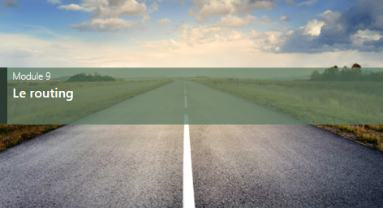

# 9 Les routes

```
npm i react-router-dom
```
## Ajouter une page modifier au VIP cocktail
- envoyer l id de la personne à la page modifier
- renommer la personne
- intégrer la maquette


https://reactrouter.com/en/main/components/nav-link  

https://v5.reactrouter.com/web/api/NavLink
  

# Nav.tsx
```tsx
import {Link} from 'react-router-dom';
export default function Nav() {
    return (
      <>
      <nav>
        <Link to={`/`}>Home</Link> | 
        <Link to={`/about/`}>About</Link> |
        <Link to={`/contact/`}>Contact</Link> |
      </nav>
      </>
    )  
  }
```

# About.tsx
```tsx
import Nav  from "../components/Nav.tsx";
export default function Contact() {
    return (
      <>
      <Nav></Nav>
      <h1> Contact</h1>
      </>
    )  
  }
```

# App.tsx
```tsx
import { RouterProvider, createBrowserRouter } from 'react-router-dom'
import Home from './pages/Home'
import About from './pages/About'
import Contact from './pages/Contact'
import Produit from './pages/Produit'

const router = createBrowserRouter([
  {path :"/", element:<Home />},
  {path :"/about", element:<About />},
  {path :"/contact", element:<Contact />},
  {path :"/produit/:id", element:<Produit />},
])

function App() {
  return (
    <>
    <RouterProvider router={router}></RouterProvider>
    </>
  )
}

export default App
```

# Produit.tsx
```tsx
import { useParams } from "react-router-dom"
import Nav  from "../components/Nav.tsx";
export default function Produit() {
    const {id} = useParams();
    return (
    <>
    <Nav></Nav>
      <h1> Produit</h1>
      <h2>{id}</h2>
    </>
    )  
  }
  ```